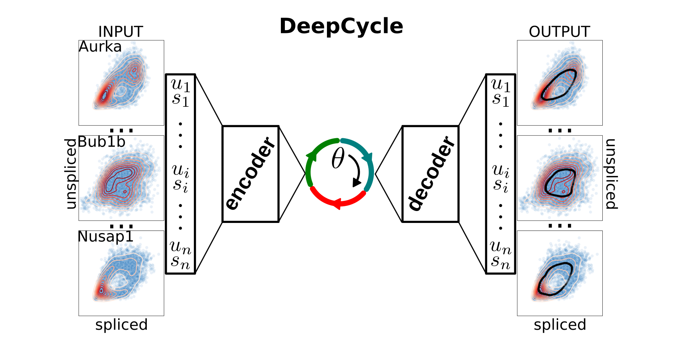
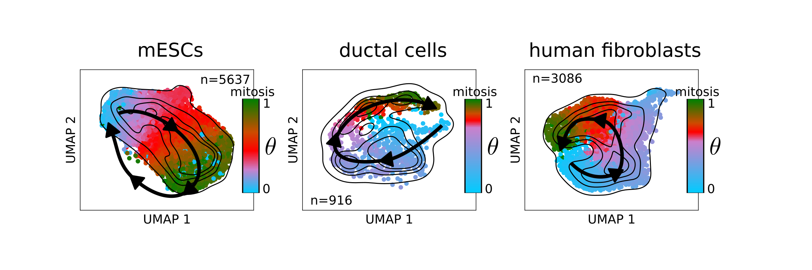

# Cell cycle analysis with RNA velocity and deep-learning

The ability of a cell to replicate is at the core of many biological processes and single-cell RNA-seq allows the study of the mechanisms regulating the cell cycle without external perturbations. DeepCycle is a method that assign a angle (transcritional phase) to each cell in your dataset, that can be associated to the cell cycle stage with further analysis. The method is based on RNA velocity and an autoencoder, and has the ability to infer underlying circular structure in your data.
DeepCycle represents a reliable method to study the cell cycle in single-cell RNA-seq datasets.



## Method

In the current version a preprocessing step is required. The moments from scVelo have to be computed, i.e. you need to run pp.moments from scVelo (https://scvelo.readthedocs.io/) to generate imputed unspliced (Mu) and spliced (Ms) expressions.
The preprocessed Anndata can then be used as input to DeepCycle. More specifically, the inputs necessary to run DeepCycle are:

* anndata preprocessed with scvelo.pp.moments.
* list of possible cycling genes for the organism of interest (e.g. GOterm cell_cycle). 
* a gene to use as initial condition for the transcriptional phase. A good strategy to detect a cycling gene is to first run DeepCycle with a random gene from the gene_list file together with the hotelling flag. The subdirectory DeepCycle/hotelling will show genes selected to show at least two different states of expression.
* a minimum value of average expression for a gene. Suggested value around 1.0, depending on your sequencing depth per cell.
* decide to run it on the GPUs, or not.
* decide to run it or not with the hotelling filter on the list of genes.
* the filename of the output anndata.

```
$ python DeepCycle.py --help
usage: DeepCycle.py [-h] --input_adata INPUT_ADATA --gene_list GENE_LIST
                   --base_gene BASE_GENE --expression_threshold
                   EXPRESSION_THRESHOLD [--gpu [GPU]]
                   [--hotelling [HOTELLING]] --output_adata OUTPUT_ADATA

Run DeepCycle.

optional arguments:
  -h, --help            show this help message and exit
  --input_adata INPUT_ADATA
                        Anndata input file preprocessed with velocyto and
                        scvelo (moments).
  --gene_list GENE_LIST
                        Subset of genes to run the inference on.
  --base_gene BASE_GENE
                        Gene used to have an initial guess of the phase.
  --expression_threshold EXPRESSION_THRESHOLD
                        Unsplced/spliced expression threshold.
  --gpu [GPU]           Use GPUs.
  --hotelling [HOTELLING]
                        Use Hotelling filter.
  --output_adata OUTPUT_ADATA
                        Anndata output file.
```

## Data

Single-cell RNA-seq data can be annotated and further analyzed as in the following examples



The datasets with annotated transcriptional phases are in the data folder.


### Dependencies

DeepCycle has the following dependencies and has been tested on the version of the packages in the parenthesis:
* python (tested on 3.7.9)
* scipy (tested on 1.5.2)
* numpy (tested on 1.19.1)
* pandas (tested on 1.1.1)
* scikit-learn (tested on 0.23.2) 
* tensorflow (tested on 2.2.0)
* anndata (tested on 0.7.4)
* matplotlib (tested on 3.3.1)
* seaborn (tested on 0.10.1)


