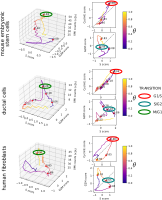

# Cell cycle analysis with RNA velocity and deep-learning

The ability of a cell to replicate is at the core of many biological processes and single-cell RNA-seq allows the study of the mechanisms regulating the cell cycle without external perturbations. DeepCycle is a method that assign an angle (transcritional phase) to each cell in your dataset, that can be associated to the cell cycle stage with further analysis. The method is based on RNA velocity and an autoencoder, and has the ability to infer underlying circular structure in your data.
DeepCycle represents a reliable method to study the cell cycle in single-cell RNA-seq datasets.

<p align="center">
  
</p>

## Method

In the current version a preprocessing step is required. The moments from scVelo have to be computed, i.e. you need to run pp.moments from scVelo (https://scvelo.readthedocs.io/) to generate imputed unspliced (Mu) and spliced (Ms) expressions.
The preprocessed Anndata can then be used as input to DeepCycle. More specifically, the inputs necessary to run DeepCycle are:

* anndata preprocessed with scvelo.pp.moments.
* list of possible cycling genes for the organism of interest (e.g. GOterm cell_cycle). 
* a gene to use as initial condition for the transcriptional phase. A good strategy to detect a cycling gene is to first run DeepCycle with a random gene from the gene_list file together with the hotelling flag. The subdirectory DeepCycle/hotelling will show genes selected to show at least two different states of expression.
* a minimum value of average expression for a gene. Suggested value around 1.0, depending on your sequencing depth per cell.
* decide to run it on the GPUs, or not.
* decide to run it or not with the hotelling filter on the list of genes.
* the filename of the output anndata.

```
$ python DeepCycle.py --help
usage: DeepCycle.py [-h] --input_adata INPUT_ADATA --gene_list GENE_LIST
                   --base_gene BASE_GENE --expression_threshold
                   EXPRESSION_THRESHOLD [--gpu [GPU]]
                   [--hotelling [HOTELLING]] --output_adata OUTPUT_ADATA

Run DeepCycle.

optional arguments:
  -h, --help            show this help message and exit
  --input_adata INPUT_ADATA
                        Anndata input file preprocessed with velocyto and
                        scvelo (moments).
  --gene_list GENE_LIST
                        Subset of genes to run the inference on.
  --base_gene BASE_GENE
                        Gene used to have an initial guess of the phase.
  --expression_threshold EXPRESSION_THRESHOLD
                        Unspliced/spliced expression threshold.
  --gpu [GPU]           Use GPUs.
  --hotelling [HOTELLING]
                        Use Hotelling filter.
  --output_adata OUTPUT_ADATA
                        Anndata output file.
                        
```

The output Anndata contains a new observation variable adata.obs[\'cell_cycle_theta\'] that represents the circular variable related to the cycling genes. In the same folder of your run, DeepCycle outputs also:

* ./fits/: the folder contains unspliced-spliced patterns to check if the fitting procedure worked properly
* ./DeepCycle_model/: TensorFlow model
* ./training/: plots of the MSE during the training
* input_data.npz: the input data used to train the model
* ./hotelling/ [only with the option --hotelling]: the genes showing more than one state of expression.

If you do not find any cycling genes the results will not be reliable. It is possible you have to sequence deeper and increase the number of RNAs per cell.
Instead, if you find the cycling patterns, but the fits are wrong, feel free to contact me (arriba87(at)gmail.com).

## Data availability

Single-cell RNA-seq data can be annotated and further analyzed as in the following examples

<p align="center">
  
</p>

h5ad files for mESCs and human fibroblasts already annotated with the cell cycle phase can be downloaded from Zenodo <a href="https://doi.org/10.5281/zenodo.4719436"></a>.

These anndata objects have been used to reproduce the results in the manuscript <a href="https://www.biorxiv.org/content/10.1101/2021.03.17.435887v1">Cell cycle gene regulation dynamics revealed by RNA velocity and deep-learning</a>.

The command to rerun DeepCycle on the mESC dataset is the following
```
python DeepCycle.py \
    --input_adata adata_mESC.h5ad \
    --gene_list go_annotation/GO_cell_cycle_annotation_mouse.txt \
    --base_gene Nusap1 \
    --expression_threshold 0.5 \
    --gpu --hotelling \
    --output_adata adata_mESC_DeepCycle.h5ad

```

where you have to substitute the input_data with the anndata that you can find on Zenodo. To reproduce the results for the human fibroblast, you have to run the DeepCycle on the subpopulation identified by the leiden clustering as 0, change the gene_list to the human cell cycle GO annotation and choose as initial gene MELK.

## Structure and training

The input and output layers of the autoencoder consist of densely connected layers of size twice the number of input genes. The densely connected layers in the blue boxes have a size of 4 times the number of genes and are activated through a leaky ReLU function. The orange box calculates the atan2 for the gene selected as input gene and concatenates this value with the output of the dense layers from the first part of the encoder. The concatenation is feeded to a Dense layer of size four times the number of genes and outputs a real number (𝜽). The real number is the input of the decoder that transforms it in (cos(𝜽), sin(𝜽)) with the layer Circularize. The bidimensional vector is then feeded to a series of densely connected layers till the output layer. The GaussianNoise layers add gaussian noise to the inputs to avoid the neural network overfitting the data. The training is performed in 2 steps:

1. training the encoder on the phases estimated from the input gene (atan2 of z-scored spliced and unspliced reads);
2. training encoder+decoder to reconstruct the unspliced-spliced reads.

<p align="center">
  
</p>

Both training steps have an early stop when they reach a plateau
tf.keras.callbacks.EarlyStopping(monitor='val_loss', min_delta=0.0, patience=20, verbose=1, mode='auto', restore_best_weights=True) and the learning rate decreases accordingly with  tf.keras.callbacks.ReduceLROnPlateau(monitor='val_loss', factor=0.8, patience=5, min_lr=0.00001). 17% of the input cells are used as validation set and the training is performed in batches of 5 cells. The optimization has been performed with Adam on the Mean Squared Error (MSE) between the input and the output.

## Automated detection of the transitions between cell cycle phases

Coming soon ...

<p align="center">
  
</p>

### Dependencies

DeepCycle has the following dependencies and has been tested on the version of the packages in the parenthesis:
* python (tested on 3.7.9)
* scipy (tested on 1.5.2)
* numpy (tested on 1.19.1)
* pandas (tested on 1.1.1)
* scikit-learn (tested on 0.23.2) 
* tensorflow (tested on 2.2.0)
* anndata (tested on 0.7.4)
* matplotlib (tested on 3.3.1)
* seaborn (tested on 0.10.1)


### Contact

For any question and problem, contact the author at arriba87(at)gmail.com.

